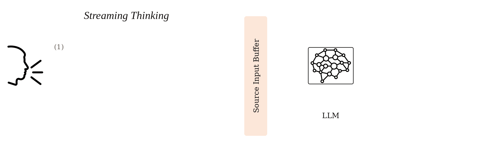

<h1 align="center"><b>Repository of Streaming Large Language Models</b></h1>

## 1. TL;DR
This repository includes a family of streaming large language models.

## 2. What are streaming LLMs?
Streaming LLMs refer to large language models that support both the progressive processing of incoming information (streaming input) and the step-by-step generation of outputs (streaming output). Building upon this foundation, we further focus on scenarios where the model performs streaming input and output simultaneously. 

There is an example for text-to-text streaming：

There is an example for speech-to-text streaming：

## 3. Content
* [ACL 2025 Findings] [LLM as Effective Streaming Processor: Bridging Streaming-Batch Mismatches with Group Position Encoding.](./StreamingLLM_GPE/README.md)
* [arxiv preprint] [StreamingThinker: Large Language Models Can Think While Reading.](./StreamingThinker/README.md)

## Contact
If you have any questions, please contact: jl-tong@sjtu.edu.cn