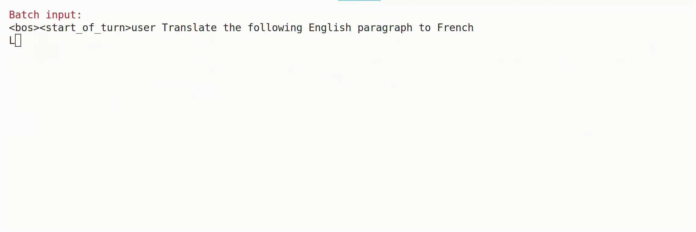
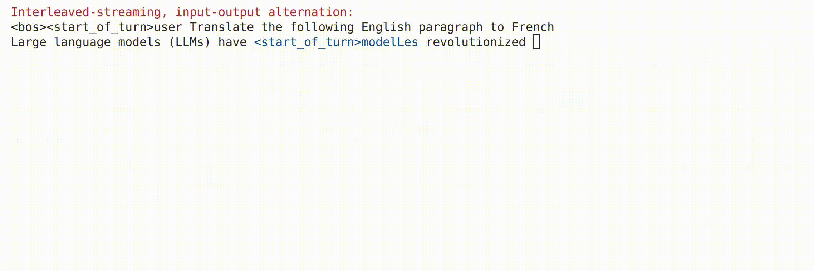
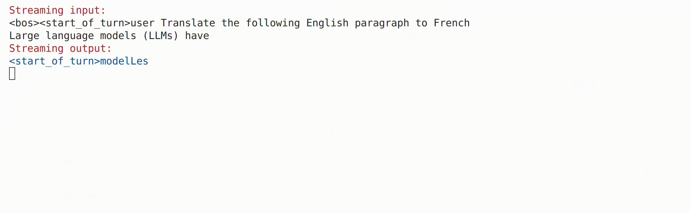
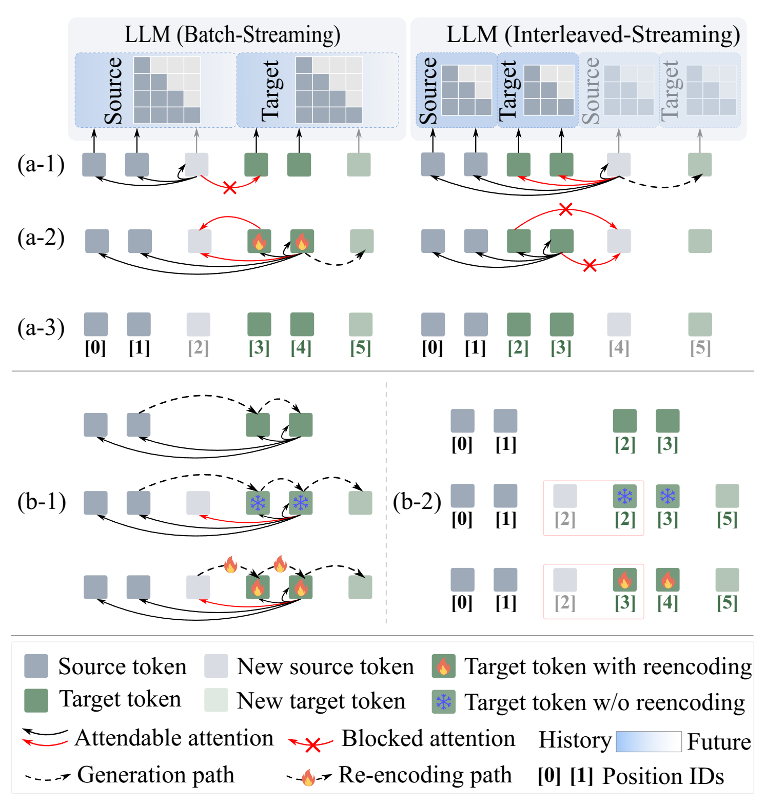

<h1 align="center"><b>LLM as Effective Streaming Processor: Bridging Streaming-Batch Mismatches with Group Position Encoding</b></h1>
</div>


<p align="center">
<a href="https://arxiv.org/abs/2505.16983" target="_blank"></a>
<a href="https://huggingface.co/JunlongTong/StreamingLLM" target="_blank"></a>

</p>


## TL;DR
We introduce a new streaming paradigm that enables large language models to achieve strong performance and generalization in streaming settings, without requiring any architectural modifications.
<!-- We introduce a new streaming paradigm that enables large language models to perform well in streaming settings, while requiring no architectural modifications. -->


## Release
Streaming speech models and additional streaming LLM implementations will be added soon.  
[05/06/2025] The code has been released!  
[22/05/2025] Our paper now can be found at https://arxiv.org/abs/2505.16983
## Batch-processing vs. streaming-processing
### batch-processing: The LLMs process inputs all at once after receiving the full sequence.

### Streaming-processing: The LLMs process the input as it arrives, incrementally and in real time.
#### Interleaved-streaming: 
The LLMs encode and generate tokens step-by-step, interleaving new input reception with ongoing decoding.

#### Our group-streaming:
The LLM processes input in grouped segments, where tokens within each group are arranged in chronological order. Source and target sequences use separate positional encodings to preserve their respective temporal structures.



## Introduction
Large Language Models (LLMs) are primarily designed for batch-processing. Existing approaches to adapting LLMs for streaming scenarios typically fall into one of three categories: computationally expensive re-encoding, interleaving input and output operations, or adopting specialized architectures that do not scale well.
This work identifies three key mismatches in adapting batch-oriented LLMs to streaming, providing actionable insights for streaming LLM design:
* **Input-attention mismatch**: Whether the source tokens can attend to the target tokens.
* **Output-attention mismatch**: Whether the target tokens can attend to the new source token.
* **Position-ID mismatch mismatch**: Whether the position IDs reflect the actual token order.



## Install
```bash
torch >= 2.4.0
transformers == 4.44.0
peft == 0.11.1
deepspeed == 0.15.4
datasets == 2.20.0
accelerate == 0.32.1
sacrebleu == 2.4.3
ijson == 3.3.0
```

## Training
```bash
accelerate launch \
    --config_file /configs/accelerate_config.yaml train.py \
    --output_dir /checkpoints \
    --epochs 1 \
    --per_bs 8 \
    --acc_steps 4 \
    --no_lora \
    --lr 5e-5 \
    --warmup_steps 3000 \
    --training_mode "streaming" \
    --split_mode "word" \
    --LLM_backbone 'Qwen' \
    --LLM_path '/LLMs/Qwen2.5-3B-Instruct'
```


## Inference
You can run `./evaluate/streaming_eval.py` for evaluation in either batch mode or group streaming mode.

## Citation
If you find this repository useful, please cite using this BibTeX:
```tex
@misc{tong2025llmeffectivestreamingprocessor,
      title={LLM as Effective Streaming Processor: Bridging Streaming-Batch Mismatches with Group Position Encoding}, 
      author={Junlong Tong and Jinlan Fu and Zixuan Lin and Yingqi Fan and Anhao Zhao and Hui Su and Xiaoyu Shen},
      year={2025},
      eprint={2505.16983},
      archivePrefix={arXiv},
      primaryClass={cs.CL},
      url={https://arxiv.org/abs/2505.16983}, 
}
```

## Contact
If you have any questions, please contact: jl-tong@sjtu.edu.cn