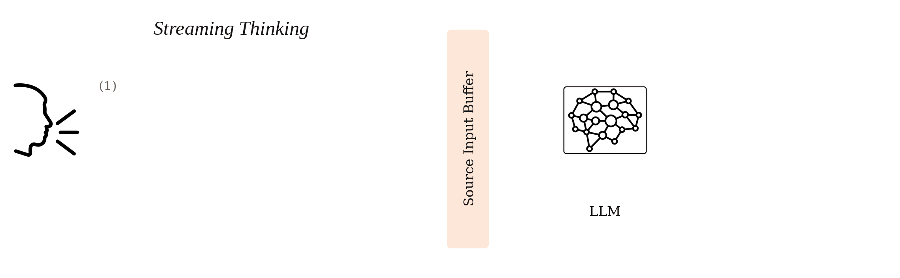

<h1 align="center"><b>Repository of Streaming Large Language Models</b></h1>

## 🚀 Latest News
**[2026-03] We have released *the first* survey paper about *Streaming LLMs/MLLMs*, covering text/speech/video stream.**

**[2026-02] *Think-as-You-See* is accepted by *CVPR 2026*.** Code will be available soon.

**[2026-01] We release a paper *Speak-While-Watching*.** 

**[2026-01] *StreamingThinker* is accepted by *ICLR 2026*.** 

**[2025-05] *StreamingLLM_GPE* is accepted by *Findings of ACL 2025*.**

## 1. TL;DR
This repository collects the works of [EIT-NLP Lab](https://idt.eitech.edu.cn/nlp/#/) on streaming LLMs/MLLMs.

## 2. Content
* **[ACL 2025 Findings]** [LLM as Effective Streaming Processor: Bridging Streaming-Batch Mismatches with Group Position Encoding.](./StreamingLLM_GPE/README.md)
* **[ICLR 2026]** [StreamingThinker: Large Language Models Can Think While Reading.](./StreamingThinker/README.md)
* **[arxiv preprint]** [Speak While Watching: Unleashing TRUE Real-Time Video Understanding Capability of Multimodal Large Language Models.](https://github.com/EIT-NLP/Speak-While-Watching)
* **[CVPR 2026]** [Think-as-You-See: Streaming Chain-of-Thought Reasoning for Large Vision-Language Models.](https://github.com/EIT-NLP/StreamingLLM/tree/main/TaYS)
* **[arxiv preprint]** [From Static Inference to Dynamic Interaction: A Survey of Streaming Large Language Models.](https://github.com/EIT-NLP/Awesome-Streaming-LLMs)

## 3. What are streaming LLMs?
Streaming LLMs refer to large language models that support both the progressive processing of incoming information (streaming input) and the step-by-step generation of outputs (streaming output). Building upon this foundation, we further focus on scenarios where the model performs streaming input and output simultaneously. The formal definition and taxonomy of streaming LLMs/MLLMs can be found in our [survey paper](https://github.com/EIT-NLP/Awesome-Streaming-LLMs).

---

Here is an example of streaming reasoning (text-to-text streaming)：

Here is an example of streaming speech recognition (speech-to-text streaming)：

## Contact
If you have any questions, please contact: jl-tong@sjtu.edu.cn
