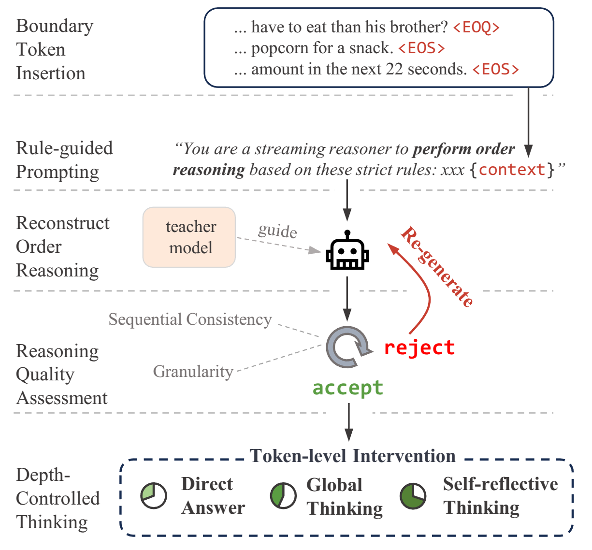
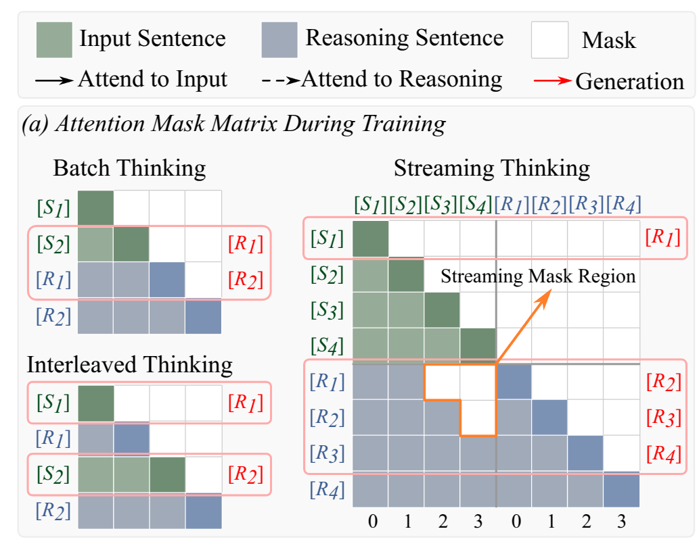
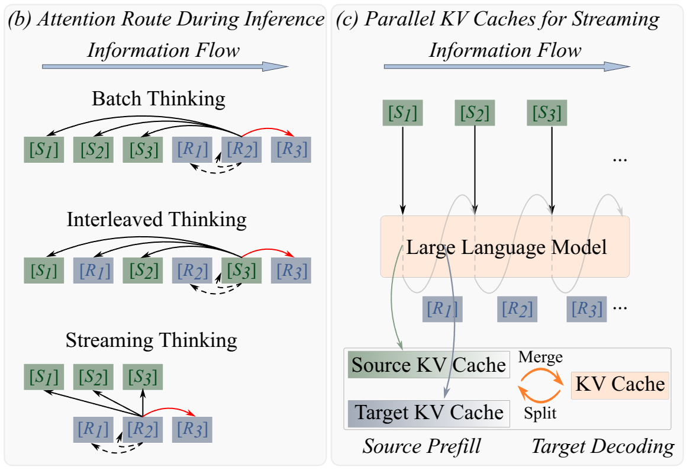

<h1 align="center"><b>[ICLR 2026] StreamingThinker: Large Language Models Can Think While Reading</b></h1>
</div>

<p align="center">
<a href="https://arxiv.org/abs/2510.17238" target="_blank"></a>
<!-- <a href="https://huggingface.co/JunlongTong/StreamingLLM" target="_blank"></a> -->
</p>


## TL;DR
**We introduce a streaming thinking paradigm that enables LLMs to reason while reading, instead of waiting until the entire input is available.** 

## News
* [x] [2026.3] Code has been released.
* [x] [2025.10] Our paper now can be found at https://arxiv.org/abs/2510.17238.

## ToDo
* [ ] Release full training set.
* [ ] Release vLLM inference version.

## 1. Introduction
Large language models have achieved impressive results in chain-of-thought reasoning, but standard reasoning pipelines remain fundamentally batch-oriented: the model only starts thinking after the entire input is received. This is inefficient for streaming scenarios such as interactive dialogue, long-context analysis, and real-time decision making.

Inspired by human cognition of thinking while reading, we propose the **streaming thinking** paradigm for LLMs. Under this paradigm, reasoning is aligned with the order of incoming input and can be refined once reading is complete. Based on this idea, we develop **StreamingThinker**, a framework that adapts batch-oriented LLMs to streaming reasoning without changing the core reasoning objective.

### 1.1 Batch Thinking vs. Streaming Thinking
| Batch thinking (Original LLM) | Streaming thinking |
| --- | --- |
| Reasoning starts only after the full input context has been observed. | Reasoning unfolds alongside the arriving input. |
<!-- <br><br>This batch-style paradigm introduces unnecessary delay and can weaken the model's focus on early information in long or dynamic inputs.|<br><br>The model incrementally reads new context, performs lightweight local reasoning during the streaming phase, and can further deepen its reasoning after the full input becomes available.  -->


### 1.2 Streaming Thinking Paradigm Design
At each step, he model incrementally processes the incoming sentence, focusing on progressive comprehension:  
* (1) understanding and summarizing key information,  
* (2) explaining ambiguities and reorganizing semantic relations,  
* (3) extending logical implications, and  
* (4) skipping thinking step when the content is irrelevant to the question.

This streaming thinking process represents the lightweight and preliminary reasoning. To accommodate problems of different difficulty levels, we design the streaming thinking paradigm to support multiple reasoning depths.
* **D1**: Direct answer after streaming thinking.
* **D2**: Global integration and reasoning after streaming thinking.
* **D3**: Self-reflective reasoning on top of streaming thinking and global integration.

This design explicitly trades off latency and reasoning depth, making the paradigm suitable for dynamic scenarios that require both responsiveness and strong reasoning quality.

## 2. StreamingThinker

StreamingThinker is built on the streaming thinking paradigm and consists of three components:
<table>
  <tr>
    <td>
      <b>👉 Streaming CoT generation</b> <br>
      StreamingThinker constructs streaming-style CoT supervision by inserting sentence-level boundary tokens into the input, generating local reasoning segments for each streaming unit, and applying quality control to retain only high-quality traces. This process produces streaming CoT data that follows the input order and supports controllable reasoning depth.
    </td>
    <td width="45%">
      
    </td>
  </tr>

  <tr>
    <td>
      <b>👉 Streaming-constrained training</b> <br>
      To align training with streaming reasoning, StreamingThinker introduces: Streaming attention masks, which prevent the current reasoning step from attending to future input. Streaming position encoding, which independently indexes input tokens and reasoning tokens to avoid positional contention and preserve local alignment.
    </td>
    <td width="45%">
      
    </td>
  </tr>

  <tr>
    <td>
      <b>👉 Streaming parallel inference</b> <br>
      At inference time, StreamingThinker maintains separate KV caches for source-side input and target-side reasoning. This decouples incremental input encoding from reasoning generation and allows the model to read and think concurrently, instead of alternating them in a strictly serial manner.
    </td>
    <td width="45%">
      
    </td>
  </tr>
</table>


## 3. Implementation
**Requriments**

```bash
git clone https://github.com/EIT-NLP/StreamingLLM.git
cd StreamingLLM/StreamingThinker

pip install -r requirements.txt
```

**Training**

An example dataset is provided in the ```StreamingThinker/data/``` folder. The complete dataset will be released soon.

To launch the training pipeline, execute the following script:
```bash
bash StreamingThinker/scripts/train_streaming.sh
```

**Inference**

We provide the evaluation code in ```StreamingThinker/evaluate/``` folder.


---

## Citation
If you find this repository useful, please cite:
```tex
@misc{https://doi.org/10.48550/arxiv.2510.17238,
  doi = {10.48550/ARXIV.2510.17238},
  url = {https://arxiv.org/abs/2510.17238},
  author = {Tong, Junlong and Fan, Yingqi and Zhao, Anhao and Ma, Yunpu and Shen, Xiaoyu},
  keywords = {Computation and Language (cs.CL), FOS: Computer and information sciences, FOS: Computer and information sciences},
  title = {StreamingThinker: Large Language Models Can Think While Reading},
  publisher = {arXiv},
  year = {2025},
  copyright = {arXiv.org perpetual, non-exclusive license}
}
```

## Contact
If you have any questions, please contact: jl-tong@sjtu.edu.cn
