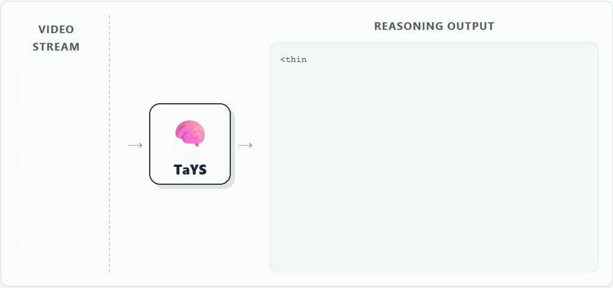
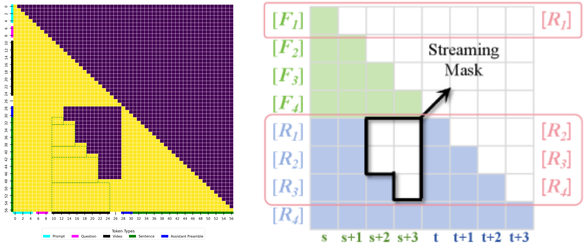

<h1 align="center"><b>[CVPR 2026] Think-as-You-See: Streaming Chain-of-Thought Reasoning for Large Vision-Language Models</b></h1>
</div>

<p align="center">
<a href="https://jialiangz.github.io/tays-project-page/" target="_blank"></a>
<a href="https://arxiv.org/abs/2603.02872" target="_blank"></a>
<!-- <a href="https://huggingface.co/JunlongTong/StreamingLLM" target="_blank"></a> -->
</p>

This repository contains the official implementation of **Think-as-You-See (TaYS)**, a streaming chain-of-thought reasoning framework for large vision-language models. TaYS enables parallel processing of visual input and reasoning generation, significantly reducing latency while improving temporal alignment accuracy.



We address streaming video reasoning from two key perspectives: **streaming attention mask** and **decoupled position IDs**. The streaming mask enforces temporal causality by restricting tokens to attend only within the current time window, while independent position indexing for vision and language tokens eliminates interference in Rotary Position Embeddings (RoPE). This combination achieves optimal results for real-time streaming inference.



## Installation

### Conda

```bash
conda env create -f environment.yml
conda activate video_streaming
```

### Pip

```bash
pip install torch==2.6.0 torchvision==0.21.0
pip install transformers==4.52.0.dev0
pip install qwen-vl-utils flash-attn deepspeed
```

## Repository Structure

```
code/TaYS/
├── Qwen2_5_vl_origin/          # Original Qwen2.5-VL baseline
├── Qwen2_5_vl_batch/           # Batch CoT training and evaluation
├── Qwen2_5_vl_batch_QA/        # Batch QA version
├── Qwen2_5_vl_interleave/      # Interleaved streaming baseline
├── Qwen2_5_vl_group/           # TaYS streaming group reasoning (main)
│   ├── model_code/
│   │   ├── modeling_qwen2_5_vl.py
│   │   ├── causal_mask_CoT.py
│   │   └── modeling_qwen2_5_vl_for_eval.py
│   ├── evaluation-group-streaming/mmmu/
│   └── qwen-vl-finetune/scripts/
└── environment.yml

data/VideoEspresso/
```

## Training

### Data Preparation

1. Download the dataset from [Hugging Face](https://huggingface.co/datasets/your-dataset)

### Training Scripts

```bash
cd Qwen2_5_vl_group/qwen-vl-finetune

# 3B model streaming CoT training
bash scripts/train_streaming_CoT_3B.sh

# 7B model streaming CoT training
bash scripts/train_streaming_CoT_7B.sh
```

## Evaluation

```bash
cd Qwen2_5_vl_group/evaluation-group-streaming/mmmu

# 3B model with different FPS
bash CoT_group_eval_3B_FPS=2.sh
```

## Citation

```bibtex
@article{zhang2026think,
  title={Think-as-You-See: Streaming Chain-of-Thought Reasoning for Large Vision-Language Models},
  author={Zhang, Jialiang and Tong, Junlong and Lin, Junyan and Wu, Hao and Sun, Yirong and Ma, Yunpu and Shen, Xiaoyu},
  journal={arXiv preprint arXiv:2603.02872},
  year={2026}
}
```

## License

Apache License 2.0
